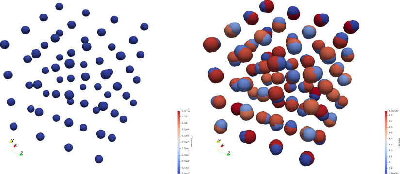

# Demo: `cell_division`

This demo aims to demonstrate cell division, i.e., mitosis in biology.
The demo shows 64 cells (agents) that are evenly distributed in three-dimensional space.
The cells grow in size whereas when they reach a maximum value in diameter, they split in two (cell division) to generate new cells.

## 0. Source BioDynaMo

Firtly you have to source BioDynaMo before doing proceeding with this demo.
```bash
. <path_to_biodynamo_installation>/build/bin/thisbdm.sh
```
Note: anytime you open a new terminal, you have to source BioDynaMo again.

You can verify that BioDynaMo has been sourced correctly by running the following command in the terminal
`biodynamo -v`. 

## 1. Build the source code of the demo

```bash
biodynamo build
```

## 2. Run the simulation of the demo

```bash
biodynamo run
```
Note: the above command automatically executes `biodynamo build` before running the simulation.

## 3. Visualize the simulation results

Open Paraview in the project directory (i.e., `<path>/cell_division`) by executing the following command in the terminal:
```bash
paraview &
```
Then, follow these steps in Paraview: `Menu: File -> Load State -> "output/cell_division/cell_division.pvsm -> OK`. 
You should now be able to see 64 spheres that represent the cells (agents) at the start of the simulation and at the end of the simulation, left and right respectively, as illustrated in the following image.

