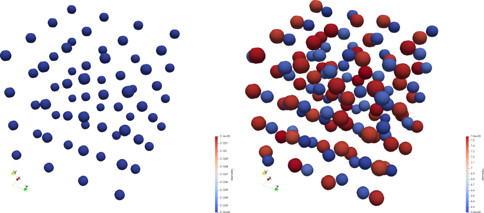

# Demo: `cell_division_enhanced`

This demo demonstrates shows 64 agents that are evenly distributed in three-dimensional space.
The agents (cells) grow in size whereas when the reach a maximum value in their diameter, they split in two halves to generate new agents - this in principle aims to represent the process of cell division (mitosis in biology).

## 0. Source BioDynaMo

Firtly you have to source BioDynaMo before doing proceeding with this demo.
```bash
. <path_to_biodynamo_installation>/build/bin/thisbdm.sh
```
Note: anytime you open a new terminal, you have to source BioDynaMo again.

You can verify that BioDynaMo has been sourced correctly by running the following command in the terminal
`biodynamo -v`. 

## 1. Build the source code of the demo

```bash
biodynamo build
```

## 2. Run the simulation of the demo

```bash
biodynamo run
```
Note: the above command automatically executes `biodynamo build` before running the simulation.

## 3. Visualize the simulation results

Open Paraview in the project directory (i.e., `<path>/cell_division_enhanced`) by executing the following command in the terminal:
```bash
paraview &
```
Then, follow these steps in Paraview: `Menu: File -> Load State -> "output/cell_division_enhanced/cell_division_enhanced.pvsm -> OK`.
You should now be able to see 64 spheres that represent the cells (agents) at the start of the simulation and at the end of the simulation, left and right respectively, as illustrated in the following image.

