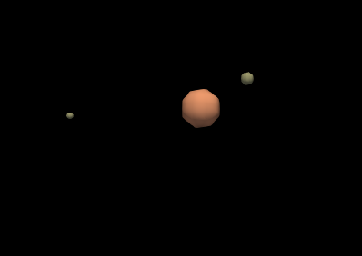

# Mars

This simulation models the gravitational interactions between Mars and its satellites, Phobos and Deimos, using realistic dimensions and masses. This demo consists of the planet Mars and its two satellites as agents, with gravitational interactions modeled using the gravity behavior.

<div align="center">
  
</div>

## Contents

- **Celestial Object Agents**
- **Gravity Behavior**
  
## Assumptions

To simplify the simulation, the following assumptions were made:
 - All celestial objects (Mars, Phobos, and Deimos) are modeled as **spheres**.
 - Celestial objects are treated as **point masses** for computational efficiency.
 - Agents can't physically interact with each other.

## Details

- **Mars**: Radius ~3,389.5 km, Mass ~6.417 × 10^23 kg.
- **Phobos**: Radius ~11.267 km, Mass ~1.0659 × 10^16 kg, Average orbital distance ~9,376 km.
- **Deimos**: Radius ~6.2 km, Mass ~1.4762 × 10^15 kg, Average orbital distance ~23,463 km.

## Newton's Law of Universal Gravitation

Newton’s law of universal gravitation governs the movement of all celestial objects in the simulation, describing the force of attraction between two masses.

The force of attraction between two objects is proportional to both their masses and inversely proportional to the square of the distance between them.

$$F = \frac{G * (m_1 * m_2)}{r^2}$$

where:
-    $F$    is the gravitational force between the two masses,
-    $G$    is the gravitational constant (6.674 × 10^-11 N·m²/kg²),
-    $m_1$   and $m_2$ are the masses of the two objects, and
-    $r$    is the distance between the centers of the two masses.

By knowing the force of attraction and therefore the acceleration of a celestial object, the displacement can be predicted by solving the below differential equation:

$$\frac{d^2x}{dt^2} = a$$

---

## Run the demos

In order to run the demos, BioDynamo has to be correctly installed and sourced.

```bash
cd [path_to_biodynamo]demos/NewtonsLawTest
bdm run
bdm view
```
In order to clearly observe the satellites in relation to the planet, feel free to scale up the diameter or volume of the satellites in the simulation.

## Verify the Results

By running the following commands:

```bash
pip install vtk 
```

```bash
cd [path_to_biodynamo]/demos/SolarSystem
python3 check_results.py
```

You can verify the accuracy of the simulation by comparing the time it takes for a celestial object to complete a full rotation.

The data were acquired from the [NASA Mars Moons Facts](https://science.nasa.gov/mars/moons/facts/), which provides real-world orbital and rotational period measurements.
