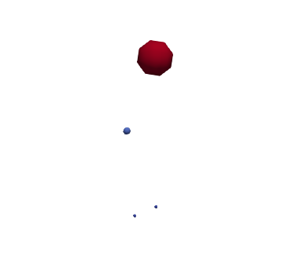

# NewtonsLawTest

This demo contains a simple algorithm that demonstrates BioDynamo's capabilities to model an environment different from what it was originally designed for. The gravity **Behaviour** was applied on **Agents** in order to model the orbital movement of planets, satellites, and stars.

<div align="center">
  
</div>

## Contents

- **Celestial Object Agents**
- **Gravity Behavior**
  
## Assumptions

To simplify the simulation, the following assumptions were made:
 - All celestial objects (planets, stars, and moons) are modeled as **spheres**.
 - Celestial objects are treated as **point masses**.
 - Agents can't physically interact with each other.

## Newton's Law of Universal Gravitation

Newton’s law of universal gravitation governs the movement of all celestial objects in the simulation, describing the force of attraction between two masses.

The force of attraction between two objects is proportional to both their masses and inversely proportional to the square of the distance between them.

$$F = \frac{G * (m_1 * m_2)}{r^2}$$

where:
-    $F$    is the gravitational force between the two masses,
-    $G$    is the gravitational constant,
-    $m_1$   and $m_2$ are the masses of the two objects, and
-    $r$    is the distance between the centers of the two masses.

By knowing the force of attraction and therefore the acceleration of a Celestial Object, the displacement can be predicted by solving the below differential equation:

$$\frac{d^2x}{dt^2} = a$$

---

## Run the demos

In order to run the demos, BioDynamo has to be correctly installed and sourced.

```bash
cd [path_to_biodynamo]demos/NewtonsLawTest
bdm run
bdm view
```
