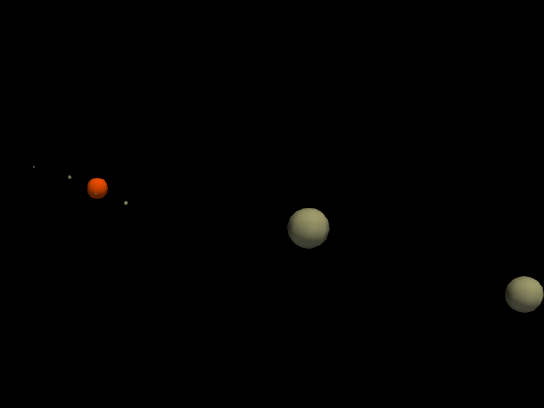

# SolarSystem

This simulation models the gravitational interactions within the Solar System, including the Sun, all eight planets, and Pluto, using realistic dimensions and masses. This demo consists of these celestial bodies as agents, with gravitational interactions modeled using the gravity behavior.

<div align="center">
  
</div>

## Contents

- **Celestial Object Agents**
- **Gravity Behavior**
  
## Assumptions

To simplify the simulation, the following assumptions were made:
 - All celestial objects (Sun, planets, and Pluto) are modeled as **spheres**.
 - Celestial objects are treated as **point masses** for computational efficiency.
 - Agents can't physically interact with each other.

## Details

The following celestial objects are included in the simulation with their approximate physical properties:

- **Sun**: Radius ~696,340 km, Mass ~1.989 × 10^30 kg.
- **Mercury**: Radius ~2,439.7 km, Mass ~3.301 × 10^23 kg, Average orbital distance ~57.91 million km.
- **Venus**: Radius ~6,051.8 km, Mass ~4.867 × 10^24 kg, Average orbital distance ~108.2 million km.
- **Earth**: Radius ~6,371 km, Mass ~5.972 × 10^24 kg, Average orbital distance ~149.6 million km.
- **Mars**: Radius ~3,389.5 km, Mass ~6.417 × 10^23 kg, Average orbital distance ~227.9 million km.
- **Jupiter**: Radius ~69,911 km, Mass ~1.898 × 10^27 kg, Average orbital distance ~778.5 million km.
- **Saturn**: Radius ~58,232 km, Mass ~5.683 × 10^26 kg, Average orbital distance ~1.434 billion km.
- **Uranus**: Radius ~25,362 km, Mass ~8.681 × 10^25 kg, Average orbital distance ~2.871 billion km.
- **Neptune**: Radius ~24,622 km, Mass ~1.024 × 10^26 kg, Average orbital distance ~4.495 billion km.
- **Pluto**: Radius ~1,188.3 km, Mass ~1.309 × 10^22 kg, Average orbital distance ~5.906 billion km.

## Newton's Law of Universal Gravitation

Newton’s law of universal gravitation governs the movement of all celestial objects in the simulation, describing the force of attraction between two masses.

The force of attraction between two objects is proportional to both their masses and inversely proportional to the square of the distance between them.

$$F = \frac{G * (m_1 * m_2)}{r^2}$$

where:
-    $F$    is the gravitational force between the two masses,
-    $G$    is the gravitational constant (6.674 × 10^-11 N·m²/kg²),
-    $m_1$   and $m_2$ are the masses of the two objects, and
-    $r$    is the distance between the centers of the two masses.

By knowing the force of attraction and therefore the acceleration of a celestial object, the displacement can be predicted by solving the below differential equation:

$$\frac{d^2x}{dt^2} = a$$

---

## Run the demos

In order to run the demos, BioDynamo has to be correctly installed and sourced.

```bash
cd [path_to_biodynamo]demos/SolarSystem
bdm run
bdm view
```
In order to clearly observe the planets and the sun, feel free to scale up the diameter or volume of the satellites in the simulation.

## Verify the Results

By running the following commands:

```bash
pip install vtk 
```

```bash
cd [path_to_biodynamo]/demos/SolarSystem
python3 check_results.py
```

You can verify the accuracy of the simulation by comparing the time it takes for a celestial object to complete a full rotation.

The data were acquired from the [NASA Planetary Fact Sheet](https://nssdc.gsfc.nasa.gov/planetary/factsheet/), which provides real-world orbital and rotational period measurements.
