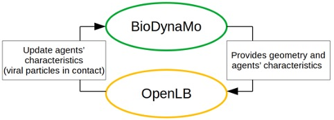

Viral contamination between individuals is favoured in closed environment, especially in poorly ventilated areas. Studying different conditions influencing the risk of infection for people in closed spaces is then critical.
Available models can not simulate both the movement of people and the turbulence of airflows and trajectory of droplets containing viral particles. Many studies only implement static individuals with detailed simulation of droplets, or agent movement alongside virus spreading but using only a simplistic diffusion mechanism.
Simulating multiple agents displacement alongside detailed virus particles spreading would be a valuable contribution to the field.

In collaboration with the epidemiological department of the University of Geneva, we are developing a computational tool for modelling multiple agents’ displacement and aerosol and droplets spreading.
We built an interface between BioDynaMo (https://biodynamo.org/), an agent based simulation framework, and OpenLB (https://www.openlb.net/), a Lattice Boltzmann fluid dynamic simulation framework. ROOT (https://root.cern.ch/) is also used as part of BioDynaMo, and to benefit from The ROOT Geometry package (https://root.cern/doc/master/classTGeoManager.html), an object oriented tool designed for building detailed geometry, then navigating and querying this geometry.
In our simulations, we use ROOT to precisely describe and model the 3D environment. Several geometry have been constructed, including a supermarket and a bus, as illustrated in Figure 1.

Figure 1: Simulation environemnts constructed using the ROOT geometry package, representing a supermarket (A) and a bus (B).

BioDynaMo is able to use this geometry to place, maintain and update all agents characteristics. This include their position and orientation, but also their health status (infectious, infected or healthy). Using the geometry, BioDynaMo is able to simulate agents navigation within the environment (for instance from the front entrance of the bus to an empty seat). Several navigation behaviour are implemented for each scenario. For instance, in the bus scenario agents can enter the bus through the front door, search for an empty seat, and exit the bus through the rear door. Bus stops are simulated at specified time steps, allowing new agents to enter the bus, and existing agents to leave.

New scenarios can easily be implemented, building the environment with ROOT, and specifying the behaviour of agents using BioDynaMo.

At defined interval of time, the current simulation’s state (environment’s geometry, agents position, orientation and health status) is exported to initialise a fluid dynamic simulation using OpenLB. This step is done every 5 seconds in our bus scenario simulation. During this simulation, each infectious agent spreads the virus with breathing or cough. We simulate the droplets/aerosol spreading taking into account the distributed size of the droplets, velocity and evaporation. Droplets are physically represented as interacting particles moved by the airflow and gravity. Airflow turbulences significantly influence the diffusion, and so is explicitly represented through a Smagorinsky turbulence model. This is shown in Figure 2.

Figure 2: Simulation of particles spreading and air-flow using OpenLB in a physical space of 4x4x20m.

Particles spreading is simulated for five seconds, after which the number of viral particles healthy individuals have been in contact to is transmitted to BioDynaMo.

Video 1 illustrates droplets spreading caused by one person standing in the alley of a bus, with other passengers seated.

Video 1: Simulation of one standing agent in a bus alley, spreading particles.

At the end of a fluid dynamic simulation, the number of viral particles each agent has been in contact to is exported and incorporated by BioDynaMo to update the health status of each agent. BioDynaMo can then simulate again agent displacement, before a new OpenLB simulation is being initialised. A schematic representation of our framework is represented in Figure 3.

Figure 3: Schematic illustration of the framework interaction workflow. BioDynaMo is in charge of simulating individual behaviours and characteristics, while the fluid dynamic simulation framework OpenLB is in charge of simulating the precise spreading of droplets and aerosols.

Being simulated independently, the fluid dynamic simulation can be freely modified to take new mechanisms into account (ventilation, convection, etc.), or even replaced by an other fluid dynamic solver, as long as the input/output format is kept identical.
This is particularly important as fluid dynamic simulation are notably resource demanding. A bus scenario iteration of the fluid dynamic simulation for 5 seconds takes up to forty five minutes using 72 cores, and requires 170GB of memory.
Well separated compartments of our framework and a flexible workflow allows the user to adjust and parametrise the fluid dynamic aspect of the simulation to its need.

As the OpenLB simulation is very time and resource consuming we did spent a considerable amount of time in researching aerosol parametrization methods that should allow much faster evaluation of the viral loads in the observed spaces. However, this has not been implemented in the current code.

This work is sponsored by a grant from the European [Open Science Cloud](https://www.eoscsecretariat.eu) (EOSC).

Jean de Montigny, Fons Rademakers and Ljudmilla Rozanova

