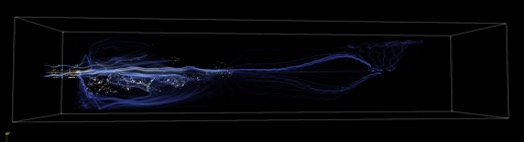

Viral contamination between individuals is enlarged in closed environments, especially in poorly ventilated areas. Studying different conditions influencing the risk of infection for people in closed spaces is then critical.
Available models can not simulate both the movement of people and the turbulence of airflows and trajectory of droplets containing viral particles. Many studies only use static individuals with detailed simulation of droplets, or agent movement alongside virus spreading but using only a simplistic diffusion mechanism.
Simulating displacement of agents together with detailed spreading of virus particles will be a valuable contribution to the field.

In collaboration with the epidemiological department of the University of Geneva, we have developed a computational tool for modeling agent displacement and aerosol and droplet spreading.
We built an interface between BioDynaMo (https://biodynamo.org/), an agent based simulation framework, and OpenLB (https://www.openlb.net/), a Lattice Boltzmann fluid dynamic simulation framework. ROOT (https://root.cern.ch/) is also used as part of BioDynaMo, and we profit from the ROOT geometry package (https://root.cern/doc/master/classTGeoManager.html), a tool designed to build detailed geometries and to navigate and query these geometries.
In our simulations, we use ROOT to precisely describe and model the 3D environment. Several geometries were constructed, including a supermarket and a bus, as illustrated in Figure 1.

BioDynaMo is able to use this geometry to place, maintain and update all agent characteristics. This include their position and orientation, but also their health status (infectious, infected or healthy). Using the geometry, BioDynaMo is able to simulate agent navigation constrained by the geometry (for instance from the front entrance of the bus to an empty seat). Several navigation behaviors are implemented for each scenario. For instance, in the bus agents can enter the bus through the front door, search for an empty seat, and exit the bus through the rear door. Bus stops are simulated at given time steps, allowing new agents to enter the bus, and other agents to leave.

One can easily define new geometries using the ROOT geometrical modeler and change agent behavior using BioDynaMo.

At given time intervals, the simulation state (geometry, agent position, orientation and health status) is exported to initialise a fluid dynamic simulation using OpenLB. This is done every 5 seconds in our bus scenario simulation. During this simulation, each infectious agent spreads the virus while breathing or coughing. We simulate the droplets/aerosol spreading taking into account the distributed size of the droplets, velocity and evaporation. Droplets are physically represented as interacting particles moved by the airflow and gravity. Airflow turbulences significantly influence the diffusion, and so is explicitly represented through a Smagorinsky turbulence model. This is shown in Figure 2.

Particles spreading is simulated for five seconds, after which the number of viral particles healthy individuals have been in contact with is transmitted to BioDynaMo.

Video 1 illustrates droplets spreading caused by one person standing in the alley of a bus, with other passengers seated.

At the end of a fluid dynamic simulation, the number of viral particles each agent has been in contact with is exported and incorporated by BioDynaMo to update the health status of each agent. BioDynaMo can then simulate again agent displacement, before a new OpenLB simulation is being initialized. A schematic of our framework is represented in Figure 3.

Since the fluid dynamic simulation is done independently it can be freely modified to take new mechanisms into account (ventilation, convection, etc.), or even be replaced by an other fluid dynamic solver, as long as the input/output format is kept identical.
This is particularly important as fluid dynamic simulation are notably resource demanding. A bus scenario iteration of the fluid dynamic simulation for 5 seconds takes up to 45 minutes using 72 cores, and requires 170 GB of memory.
Clear separation between the frameworks and a flexible workflow allows the user to adjust and parametrize the fluid dynamic aspect of the simulation as needed.

As the OpenLB simulation is time and resource consuming we did spent a large amount of time in researching aerosol parametrization methods that should allow much faster evaluation of the viral loads in the observed spaces. However, during the this of this project we did not find a proper parametrization code.

The technical paper and all codes of this project can be found in the following Zenodo online repository: [http://doi.org/10.5281/zenodo.5534456](http://doi.org/10.5281/zenodo.5534456).

This work is sponsored by a grant from the [European Open Science Cloud](https://www.eoscsecretariat.eu) (EOSC).
EOSCsecretariat.eu has received funding from the European Union's Horizon Programme call H2020-INFRAEOSC-05-2018-2019, grant Agreement number 831644.

Jean de Montigny, Fons Rademakers

