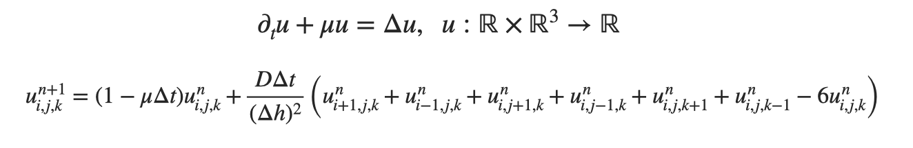
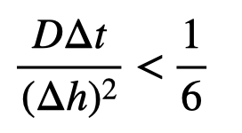
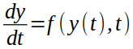
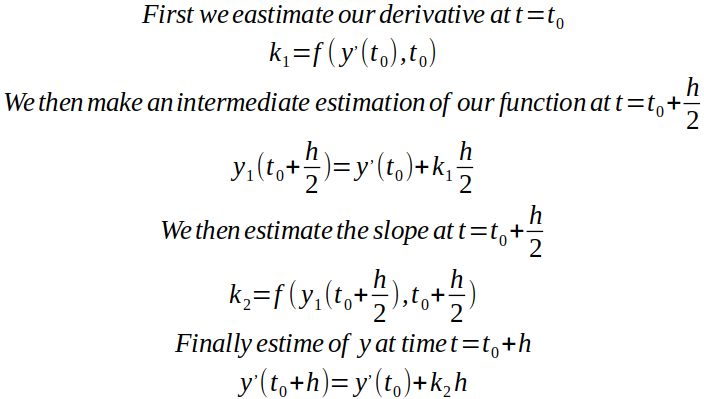

One of BioDynaMo's built-in biological processes is extracellular diffusion.
It is the process of extracellular substances diffusing through space. The constants
that govern the diffusion process can be set by the user. Let's go through an
example where diffusion plays a role.

### Copy the demo code

`diffusion` is one of many installed demos in BioDynaMo. It can be copied out
with `biodynamo demo`.

```bash
biodynamo demo diffusion .
```

### Inspect the code

Go into the `diffusion` directory and open the source file `src/diffusion_biology_modules.h` in your favorite editor.
We can note the following things from its content:

#### 1. Substance list

```cpp
enum Substances { kKalium };
```

The extracellular substances that will be used in the simulation are listed in
an `enum` data structure. In this case it is just a single substance. According to our C++
coding style we will prepend the substance's name with the letter "k".

#### 2. Biology modules

In the same file you can find the definition of the biology modules `Chemotaxis`
and `KaliumSecretion`. These are the modules that will govern the
behavior of the simulation objects (i.e. cells).

#### 3. Initial model

Open the `src/diffusion.h` source file.

First, create a BioDynaMo simulation:
```cpp
Simulation simulation(argc, argv);
```

Next up is creating the initial model of our simulation.
Therefore, we have to create an initial set of simulation objects and set their
attributes:

```cpp
  auto construct = [](const Double3& position) {
    Cell* cell = new Cell(position);
    cell->SetDiameter(30);
    cell->SetMass(1.0);
    cell->AddBiologyModule(new Chemotaxis());
    Double3 secretion_position = {{50, 50, 50}};
    if (position == secretion_position) {
      cell->AddBiologyModule(new KaliumSecretion());
    }
    return cell;
  };
  std::vector<Double3> positions;
  positions.push_back({0, 0, 0});
  positions.push_back({100, 0, 0});
  positions.push_back({0, 100, 0});
  positions.push_back({0, 0, 100});
  positions.push_back({0, 100, 100});
  positions.push_back({100, 0, 100});
  positions.push_back({100, 100, 0});
  positions.push_back({100, 100, 100});
  // the cell responsible for secretion
  positions.push_back({50, 50, 50});
  ModelInitializer::CreateCells(positions, construct);
```

The `construct` lambda defines the properties of each cell that we create. These can be
physical properties (diameter, mass), but also biological properties and behaviors
(chemotaxis, substance secretion)

In this example, each cell is assigned the `Chemotaxis` behavior. In `diffusion_biology_behaviors.h` you can
check the source code of this module. Basically it makes cells move according to the gradient,
caused by a concentration difference of the substance. One of the cells
(the cell at position `{50, 50, 50}`) will be the one secreting the substance;
it therefore gets assigned the `SubstanceSecretion` behavior.

Furthermore, we define the initial positions of the cells. In this example it is
done explicitly, but one could also generate a grid of cells, or a random distribution
of cells.

### Simulation Parameters

Create a `bdm.toml` file in the `diffusion` directory, and copy the following lines
into it:

```
[visualization]
export = true
export_interval = 10

	[[visualize_sim_object]]
	name = "Cell"
	additional_data_members = [ "diameter_" ]

	[[visualize_diffusion]]
	name = "Kalium"
	gradient = true

```

This will enable exporting visualization files, so that we can visualize the
simulation after it has finished. Furthermore, we enable the output of the diameter
of our simulation objects (by default named "Cell"), and the gradient data of the
extracellular diffusion

### Build and run the simulation

Run the following commands to build and run the simulation.

``` bash
biodynamo run
```

### Visualize the simulation

Load the generated ParaView state file as described in [Section Visualization](/docs/userguide/visualization/#export-visualization-files).

From "View", select "Animation Panel". This will display some animation settings
at the bottom of the screen. From the "Mode" select "Real Time".
Then click the Play button at the top of the screen to run the simulation visualization.

<video width="100%" controls>
  <source src="https://cernbox.cern.ch/index.php/s/rzl2Kb4uxny4ZXF/download?path=%2F&files=exported_visualization.mp4" type="video/mp4">
  Your browser does not support the video tag.
</video>

### Diffusion parameter constraints
The differential equations that describe the diffusion are solved in an
analytical way using the central difference method as shown in the figure below:

[](/docs/userguide/diffusion/#diffusion-parameter-constraints)

The diffusion coefficient dictates the speed of diffusing a substance through
space, while with the decay constant one controls the speed at which a substance
decays. Mathematically, the method would allow for unphysical behavior to occur, such as
negative concentration values. In order to avoid such behavior from happening,
we impose the following constraint on the parameters:

[](/docs/userguide/diffusion/#diffusion-parameter-constraints)

Since as a user, you are giving the resolution of the diffusion grid and not the
distance between the grid points, you can determine this value by dividing the
longest dimension of your space by the resolution, or by calling the corresponding
function `DiffusionGrid::GetBoxLength()`.

For more information on the inner workings of the diffusion module, please
refer to: https://repository.tudelft.nl/islandora/object/uuid%3A2fa2203b-ca26-4aa2-9861-1a4352391e09?collection=education

### Runge-Kutta method:
We have additionally implemented the 2nd order Runge-Kutta method within BioDynaMo.
The Runge-Kutta method is an iterative method for solving ordinary differential equations (ODEs) ,both implicitly and explicitly. Often out performing the Euler method for complex ODEs. 

The Runge-Kutta method solves ODEs of the form:

[](/docs/userguide/diffusion/#runge_kutta_function)

We estimate a solution explicitly using the following steps:

[](/docs/userguide/diffusion/#runge_kutta_equation)

Here k1 is the slope at the beginning of the interval and k2 is the slope at the midpoint of the interval. With h determining interval length being solved for.

To access the Runge-Kutta method for diffusion, one simply needs to update the bdm.toml file as follows :

```
[visualization]
export = true
export_interval = 10
diffusion_type_ = "RK"

	[[visualize_sim_object]]
	name = "Cell"
	additional_data_members = [ "diameter_" ]

	[[visualize_diffusion]]
	name = "Kalium"
	gradient = true
```

Notes :
* This method requires the input of known initial boundary conditions for the ODE being solved.
* This method is also commonly referred to as the midpoint method or improved Euler.	
* This method can additionally be used to solve partial differential equations (PDEs) but requires each component to be individually broken down into separate ODEs.  


