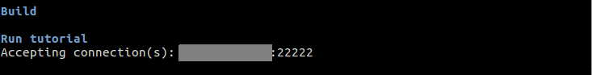

# BioDynaMo short tutorial

Written by Jean de Montigny  

## Introduction

BioDynaMo is platform for computer simulations of biological dynamics. You can learn more about BioDynaMo by accessing its official website.

This Tutorial in designed for user with limited knowledge of C++ language and will teach you the basics of BioDynaMo:

* Create, build and run a new project
* Create cells with a specific behaviour through a biological module
* Extend an existing structure
* visualise a simulation

### Installation

You can access the installation page by clicking [here](https://biodynamo.github.io/user/installation/).

### Structure creation

As BioDynaMo is written is C++, it needs a particular structure. Fortunately, this procedure is really easy with BioDynaMo. To create a new project, you just need to run the command `biodynamo new <project>`. If you wish to have your Github account linked to your project you can append the `--github` option to the command. Try opening a terminal and running the command `biodynamo new tutorial`. This will create a folder named tutorial in your current directory, containing everything that BioDynaMo needs. Inside tutorial/src, two files with the basic structure already written have been created: tutorial.cc and tutorial.h. tutorial.cc will only contain the call to the header tutorial.h which will be the core of our work. You can easily compile your code using the command `biodynamo build` and run your simulation by typing the command `biodynamo run`.
You can also directly use `biodynamo demo tumor_concept` to try this demo.

## Cells and biology Module

The structure build in the previous chapter only creates a single cell. In this chapter we will in a first time create more cells in order to building a square of 2 400 randomly distributed cells. Then in a second time, we will create a number of cancerous cells, that will grow and divide.

### Creating cells

To do so, we will work only on the `Simulate` function of the tutorial.h file. Inside the Simulate method, we need to define a resource manager and a structure to contain our cells:
``` C++
Simulation<> simulation(argc, argv);
auto* rm = simulation.GetResourceManager(); // set up resource manager

auto* cells = rm->template Get<Cell>(); // create a structure to contain cells
```

Because we want 2400 cells randomly distributed, it is mandatory to have an random number generator to generate x, y and z coordinate of each cell. For that, we will declare three double (x_coord, y_coord and z_coord) and use the included random engine. Still inside the Simulate method, write:
``` C++
auto* random = simulation.GetRandom(); // set up the random engine
auto* param = simulation.GetParam(); // set up param

  size_t nb_of_cells=2400; // number of cells in the simulation
  param->min_bound_ = 0;
  param->max_bound_ = 100; // cube of 100*100*100
  double x_coord, y_coord, z_coord;

  cells->reserve(nb_of_cells); // allocate the correct number of cell in our cells structure before cell creation
```

Then, with a simple loop from 0 to the number of cells, we will be able to fill this cells structure with cell elements.
``` C++
  for (size_t i = 0; i < nb_of_cells; ++i) {
    // our modelling will be a cell cube of 100*100*100
    // random double between min_bound and max_bound ( 0 and 100)
    x_coord = random->Uniform(param->min_bound_, param->max_bound_);
    y_coord = random->Uniform(param->min_bound_, param->max_bound_);
    z_coord = random->Uniform(param->min_bound_, param->max_bound_);
    // creating the cell at position x, y, z
    Cell cell({x_coord, y_coord, z_coord});
    // set cell parameters
    cell.SetDiameter(7.5);

    cells->push_back(cell); // put the created cell in our cells structure
  }
  cells->Commit();  // commit cells
```

We now have our structure containing all the 2400 cells! The code in charge of running our modelling is already written and will simulate it for only one step. Lets change this to simulate for 100 steps.
``` C++
simulation.GetScheduler()->Simulate(200);
```

### Biology module

In the previous chapter, we created a great number of cells. However, those cells don’t do anything! We will here create a cancerous cell that will grow and divide when it reaches a certain diameter. For this, we will define a new biology module structure GrowthModule that will be applied to cell elements, and we will make this GrowthModule copied into the cell daughter (so the daughter will also contain an instance of the biology module GrowthModule)
``` C++
  struct GrowthModule : public BaseBiologyModule {
  GrowthModule() : BaseBiologyModule(gAllBmEvents) {}

    template <typename T>
      void Run(T* cell) {
        // code to be executed each at simulation step
      }

    ClassDefNV(GrowthModule, 1);
  };
```

We are now able to add any code in the Run() method, that will be executed at each simulation step for each cell containing this GrowthModule. In our case, it will be a cellular growth, until a certain diameter is reached and then a cell division:
``` C++
      if (cell->GetDiameter() < 8) {
        cell->ChangeVolume(400);
      }
      else {
        cell->Divide();
      }
```

After creating our GrowthModule, we need to add this Biology module to the compile time parameter, to tell BioDynaMo to use this new BiologyModule
``` C++
  template <typename Backend>
    struct CompileTimeParam : public DefaultCompileTimeParam<Backend> {
      using BiologyModules = Variant<GrowthModule>; // add GrowthModule
  };
```

Of course, we need to create at least one new cell that contains our GrowthModule in our Simulate method
``` C++
  Cell cell ({20, 50, 50});
  cell.SetDiameter(6);
  cell.AddBiologyModule(GrowthModule());
  cells->push_back(cell);
```

Run running it using `biodynamo run`. This code is now able to create and simulate 2 400 normal cells and 1 cancerous cell that will grow and divide! Complete codes for tutorial.cc and tutorial.h of this chapter are accessible at the end of this tutorial.

## Visualisation using Paraview

In the previous chapter we created a simulation of a great number of cell, also containing dividing cancerous cells, but we were not able to visualise anything! In this chapter, we will set up a visualisation using Paraview (included in the BioDynaMo package). Dedicated page about visualisation can be accessed [here](https://biodynamo.github.io/user/visualization/)

### Paraview

[Paraview](https://www.paraview.org/) is an open source application for interactive and scientific visualisation. First of all, we need to tell BioDynaMo that we will use Paraview and so that we want the visualisation to be enable. To do that, we need to create a configuration file `bdm.toml` in the tutorial folder. Visualisation is of course not the only configuration we can do using this file. You can allow live visualisation and/or export visualisation (here every 2 simulation step) by adding in bdm.toml
``` C++
[visualization]
live = false
export = false
export_interval = 2
```

you also can say to Paraview to visualise a particular parameter of ours cells, for example the diameter of every cells. Do do that, add below \[visualization\] in the configuration file the following lines
``` C++
    [[visualize_sim_object]]
    name = "Cell"
```
Because those visualisation parameters are not in the source code, you don’t need to compile your code again.
We can note that instead of creating a configuration file, you can do the same by adding directly in our Simulate function the lines
``` C++
    param->live_visualization_ = true; // allows live visualisation
    param->export_visualization_ = true; // allows export of visualisation files
    param->visualization_export_interval_ = 2; // export visualisation files every 2 steps
    param->visualize_sim_objects_["Cell"] = std::set<std::string>{ "diameter_" }; // add the data member diameter_ to the visualisation objects
```
Once again, it is important to note that if you want to change any visualisation parameter using this second method, you will have to compile again your code. That is not the case using a configuration file. Hence, using the toml file is highly recommended.  

We will first see export visualisation then the live visualisation. In both cases, simply run Paraview using the console line command `paraview &`. This windows should appears


#### Export Visualisation (recommended)

In the configuration file (bdm.toml), turn the export parameter to true then run your modelling. You’ll notice the creation of several new files with the following file extensions `*.pvsm, *.pvtu, *.vtu, *pvti, *.vti` in the folder output/tutorial. Open ParaView and load the generated state file as described in [Section Visualization](visualization.md#export-visualization-files) (file -> load state)

A major advantage of export visualisation, in addition of not impacting the simulation time, is that you can visualise your modelling freely in time. using the arrows in the top menu, you can choose respectively to go back to the beginning of the simulation, go one step back, run normally, go one step further or go to the end of the simulation. You also can see witch step you are currently visualising (remember that this step number is the number of your modelling step divided by the export\_interval you choose in your configuration file).


#### Live visualisation

To use live visualisation, turn the live option of your configuration file to true, then click on the _Catalyst_ top menu, and select _Connect_ . This windows should appears


Click OK, then this windows should appears


Your Paraview is now accepting connections! Click OK, go back to the _Catalyst_ menu, and select _Pause Simulation_. Using the same console, launch your tutorial simulation. You now notice that the programme stop right before running the simulation, because we used the Paraview _Pause Simulation_.



Go back to Paraview. You notice that new objects have appeared in the _Pipeline Browser_ section. Click on the round shape in front of _Cells Glyph_.


A new Builtin object have appeared: _Extract: Cells Glyph_. Click on the eye in front of it.


All cells appear on the screen!
You can now go to the _Catalyst_ menu, and select _Continue_. The simulation will run the number of steps you specified in your code.


Even if live visualisation is particularly useful to set or tune a simulation, it is capital to note that it also drastically slows down the simulation! One way to avoid this major problem is to export visualisation files and read then after the modelling is done.

In both cases, even if we can now visualise our cell, they have all the same colour, which can be a bit confusing and doesn't allow us to visualise properly what is going on.

### Adding layers colour

In this chapter, we will modify our code in order to create a better colouring for our simulation.  
A good idea would be to create a colouring depending on the y axis coordinate. By this way, we could display several layers of cell, and have an other colour for our cancerous cells.
To do that, we can extend the existing `Cell` class in order to add a new data member `cell_colour`.
We will do that directly in our tutorial.h file by writing
``` C++
  // Define my custom cell MyCell, which extends Cell by adding extra data members: cell_colour
  BDM_SIM_OBJECT(MyCell, bdm::Cell) { // our object extends the Cell object
    BDM_SIM_OBJECT_HEADER(MyCellExt, 1, cell_colour_); // create the header with our new data member

    public:
      MyCellExt() {}
      MyCellExt(const std::array<double, 3>& position) : Base(position) {} // our creator
      // getter and setter for our new data member
      void SetCelColour(int cellColour) { cell_colour_[kIdx] = cellColour; }
      int GetCellColour() { return cell_colour_[kIdx]; }
      int* GetCellColourPtr() { return cell_colour_.data(); }

    private:
    // private data can only be accessed by public function and not directly
      vec<int> cell_colour_; // declare our new data member and define its type
  };
```

Don't forget to add this new object to your compile time parameters (inside "struct CompileTimeParam") so BioDynaMo know that we want to use our custom `MyCell` object. This is done by adding the line
``` C++
    using AtomicTypes = VariadicTypedef<MyCell>;
```

Each cell (implementing our new object `MyCell`) of the modelling is now able to have a value cell\_colour\_ that we will choose and use to display different colours!  
In order to create cells with this attribute, we need to replace all Cell object by MyCell during cells creation (inside the `Simulate()` method). For example
``` C++
//  auto* cells = rm->template Get<Cell>(); // previous structure containing Cell objects
  auto* cells = rm->template Get<MyCell>(); // new structure containing MyCell objects
[...]
//     Cell cell({x_coord, y_coord, z_coord}); // creats a cell as a Cell object; so doesn't contain cell_colour_
    MyCell cell({x_coord, y_coord, z_coord}); // creats a cell as a MyCell object; so contains cell_colour_
```

Now that we are creating cells implementing MyCell, we can set the cancerous cell cell\_colour\_ value to 8 (so it will have a really distinct colour from non cancerous cells). To do so, simply use the method SetCellColour() we created
``` C++
    cell.SetCellColour(8);
```

Do the same for the regular cells, setting the value depending on the y axis value. One possibility is to write
``` C++
    cell.SetCellColour((int)(y_coord / param->max_bound_ * 6)); // will vary from 0 to 5. so 6 different layers depending on y_coord
```

This new simulation is now functional, however before running it, we need to tell BioDynamo to communicates all cell\_colour\_ values. Do do that, we will modify the configuration file bdm.toml by modifying the visualize\_sim\_object
``` C++
    [[visualize_sim_object]]
        name = "MyCell"
        additional_data_members = [ "cell_colour_" ]
```

With those changes, we are now able to colourise our different layers. All you have to do, after displaying cells and creating the _Glyph_ filter (chapter 3.1) is to select your _Glyph_ filter and to select cell\_colour\_ in the _Coloring_ section.


Well done, we can now visualise the different layers and the cancerous cell in red!


However, there still is a little problem. The attribute cell\_colour\_ is not transmitted to the daughter cell after a division. You can also notice that it is not really easy to see the cancerous cells. We will solve those issues in the next chapter.

### Transmitting its colour and playing with Filters

To enable dividing cells to transmit its colour - meaning its cell\_colour\_ attribute value - we have to modify a little our biology module.
``` C++
//        cell->Divide(); // old
        auto&& daughter = cell->Divide(); // we now have access to the daughter
        daughter->SetCellColour(cell->GetCellColour()); // daughter cell_colour_ is setted to her mother cell_colour_ value
```

Even if our cancerous cells transmit their colour to their daughter, it still is not really easy to spot them in the middle of thousands of other cells. This problem can be solve using the threshold filter function of Paraview. To do that, after displaying cells colour as at the end of 3.2, click on the threshold filter button. This filter will be applied to the currently selected _Pipeline Browser_, so pay attention to select the correct one (_Glyph1_) before creating the threshold filter.


On the _Properties_ menu, select the _Scalar_ _cell\_colour\__, put the minimum value at 7 and the maximum at 8 (so only the value of cancerous cell is selected) then click _Apply_


Finaly, choose the _Coloring_ mode _cell\_colour\__.


Great, we can now choose to display either all the cells, or just the cancerous cells by selecting either the _Glyph1_ or the _Threshold1_ in the _Pipeline Browser_!


This is of course just an example of what you can do with the threshold filters.

### Adding some complexity

We now have all we want to visualise our modelling in the best conditions, but this modelling itself is a bit limited. We should add some movements to it as well as a new mechanism to complexify cell division.
To add cell movement, we will modify the `Run()` method of our biology module `GrowthModule`, and use the function `UpdatePosition()`. To generate the direction's random numbers we will again use the `Uniform()` function which allow us to generate a random number between two specified numbers. First, we need to add `TSimulation` to the template and to define the random engine.  
``` C++
template <typename T, typename TSimulation = Simulation<>>
void Run(T* cell) {
  auto* random = TSimulation::GetActive()->GetRandom();
```

We choose here to give stochastic movement only to growing cells, so we will write the movement just after the volume change
``` C++
    // create an array of 3 random numbers between -2 and 2
    std::array<double, 3> cell_movements = random->template UniformArray<3>(-2, 2);
    cell->UpdatePosition(cell_movements); // update the cell mass location, ie move the cell
```

Using the previous chapters, you should now be able to visualise cell movement during their growth.  
This is great, but every cancerous cell grows and divides indefinitely, and that is a bit too much. We will now add a mechanism to reduce the probability to divide, and assuring that a cancerous cell that didn't divide, will never divide any more.  
To add a 0.8 probability to divide, simply write
``` C++
    if (random->Uniform(0, 1) < 0.8) {
      auto daughter = cell->Divide();
      daughter->SetCellColour(cell->GetCellColour());
    }
```

Cells will now have only 80% chance to divide. However, it will have 80% chance to divide at every simulation step! We want that if a cell doesn't divide, it will not be able to divide any more.
To do that, we will create a new MyCell boolean attribute called can\_divide\_. As well as for the cell\_colour\_ attribute (see chapter 3.2), add it our MyCell object header
``` C++
BDM_SIM_OBJECT_HEADER(MyCellExt, 1, can_divide_, cell_colour_);
```

and create two methods, `SetCanDivide()` and `GetCanDivide()`.
``` C++
    void SetCanDivide(bool d) { can_divide_[kIdx] = d; }
    bool GetCanDivide() { return can_divide_[kIdx]; }
```

Then, as for cell\_colour\_, declare this data member as private
``` C++
    vec<bool> can_divide_;
```

Now that we got a new attribute can\_divide\_, we need to change the `Run()` method to prevent cells that failed the 80% test to divide again.
Finally, don't forget to set the daughter can\_divide\_ value to true after a cell division.
``` C++
      if (cell->GetCanDivide() && random->Uniform(0, 1) < 0.8) {
        auto&& daughter = cell->Divide();
        // daughter take the cell_colour_ value of her mother
        daughter->SetCellColour(cell->GetCellColour());
        daughter->SetCanDivide(true);  // the daughter will be able to divide
      } else {
        cell->SetCanDivide(false);  // this cell won't divide anymore
      }
```

Codes corresponding to this chapter is accessible [here](https://github.com/BioDynaMo/biodynamo/tree/master/demo/tumor_concept).

You now have all the BioDynaMo cell basic knowledge to construct your own modelling!

## Diffusion

Coming soon.

## Code

### tutorial.h - chapter 2.2

``` C++
#ifndef TUTORIAL_H_
#define TUTORIAL_H_

#include "biodynamo.h"

namespace bdm {

  // 1. Define growth behaviour
  struct GrowthModule : public BaseBiologyModule {
    GrowthModule() : BaseBiologyModule(gAllBmEvents) {}

    template <typename T>
    void Run(T* cell) {
      if (cell->GetDiameter() < 8) {
        cell->ChangeVolume(400);
      }
      else {
        cell->Divide();
      }
    }

    ClassDefNV(GrowthModule, 1);
  };

  // Define compile time parameter
  template <typename Backend>
  struct CompileTimeParam : public DefaultCompileTimeParam<Backend> {
    using BiologyModules = Variant<GrowthModule>;  // add GrowthModule
  };


  inline int Simulate(int argc, const char** argv) {
    Simulation<> simulation(argc, argv);
    auto* rm = simulation.GetResourceManager(); // set up resource manager
    auto* param = simulation.GetParam(); // set up params
    auto* random = simulation.GetRandom(); // set up the random engine

    size_t nb_of_cells = 2400;  // number of cells in the simulation
    double x_coord, y_coord, z_coord;

    param->bound_space_ = true;
    param->min_bound_ = 0;
    param->max_bound_ = 100;  // cube of 100*100*100
    param->run_mechanical_interactions_ = true;

    // create a structure to contain cells
    auto* cells = rm->template Get<Cell>();
    // allocate the correct number of cell in our cells structure before
    // cell creation
    cells->reserve(nb_of_cells);

    for (size_t i = 0; i < nb_of_cells; ++i) {
      // our modelling will be a cell cube of 100*100*100
      // random double between 0 and 100
      x_coord = random->Uniform(param->min_bound_, param->max_bound_);
      y_coord = random->Uniform(param->min_bound_, param->max_bound_);
      z_coord = random->Uniform(param->min_bound_, param->max_bound_);

      // creating the cell at position x, y, z
      Cell cell({x_coord, y_coord, z_coord});
      // set cell parameters
      cell.SetDiameter(7.5);

      cells->push_back(cell);  // put the created cell in our cells structure
    }

    // create a cancerous cell, containing the BiologyModule GrowthModule
    Cell cell({20, 50, 50});
    cell.SetDiameter(6);
    cell.AddBiologyModule(GrowthModule());
    cells->push_back(cell);  // put the created cell in our cells structure

    cells->Commit();  // commit cells

    // Run simulation
    std::cout << "simulating" << std::endl;
    simulation.GetScheduler()->Simulate(200);

    std::cout << "Simulation completed successfully!" << std::endl;
    return 0;
  } // end simulate

}  // namespace bdm

#endif // TUTORIAL_H_
```
