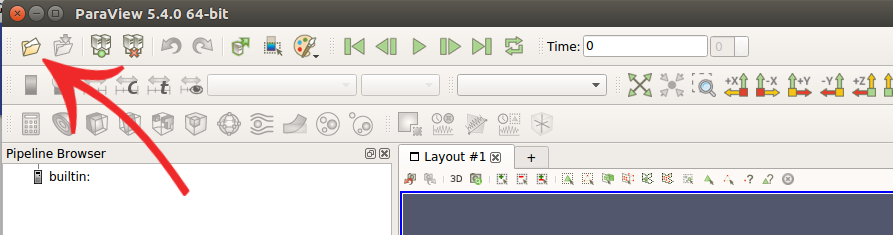
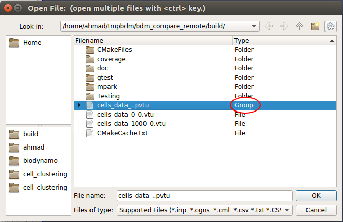

Enabling visualization is very easy. BioDynaMo can be configured through its own
configuration file: `bdm.toml`. Visualization is just one of the many configuration
options. Let's take a look at how to set it. We shall continue using the `hello_world`
example from the previous exercise.

## Create the configuration file

In your simulation directory `hello_world` create a new file called `bdm.toml`.
You can also do this from the command line with the following command:

``` sh
touch bdm.toml
```

## Export visualization files

One way to enable visualization is to export a visualization file every time step 
(or every N time steps). In the `bmd.toml` file add the following lines:

```
[visualization]
export = true
export_interval = 1

	[[visualize_sim_object]]
	name = "Cell"
	additional_data_members = [ "diameter_" ]

```

This will export a visualization file every time step. You can set the frequency
by setting the `export_interval`. Make sure that you run a good number of steps
so that the cells have time to divide. Set it to around 2000 for the `hello_world` example.
You can do this in `src/hello_world.h` in the `scheduler.Simulate(time_steps)` function.
Run your simulation with `biodynamo run`.

Now we need to open ParaView:

#### On Linux:

``` sh
biodynamo.paraview
```

#### On Mac OS:

``` sh
paraview
```

And select "Open" as shown below:



Navigate to your simulation directory.
Then select the files that represent your simulation objects. If you have 
output over multiple timesteps, import your simulation objects as "Group", as
shown in the image below:



Click on the `cells_data_` entry in the Pipeline Browser and press "Apply". From "Filters", select
"Search" (or do Ctrl + Space). Search for the "Glyph" filter, Apply it, and set
the following properties:

``` Python
Glyph Type 		= 'Sphere'
Scalars 		= 'diameter_'
Glyph Mode 		= 'All Points'
Scale Mode		= 'Scalar'
Scale Factor	= 1
Coloring		= 'diameter_'
```

Press "Apply" to let the changes take effect.

From "View", select "Animation Panel". This will display some animation settings
at the bottom of the screen. From the "Mode" select "Real Time".
Then click the Play button at the top of the screen to run the simulation visualization.


<!-- ## Live visualization

Another way to enable visualization is through ParaView's live visualization.
This feature allows you to inspect your simulation while it is running. In your
`bdm.toml` file you add the following lines:

```
[visualization]
live = true
```
 -->

