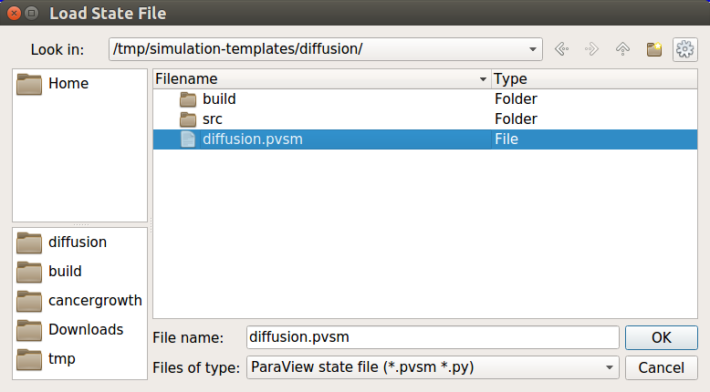

Enabling visualization is very easy. BioDynaMo can be configured through its own
configuration file: `bdm.toml`. Visualization is just one of the many configuration
options. Let's take a look at how to set it. We shall continue using the `hello_world`
example from the previous exercise.

## Create the configuration file

In your simulation directory `hello_world` create a new file called `bdm.toml`.
You can also do this from the command line with the following command:

``` sh
touch bdm.toml
```

## Export visualization files

One way to enable visualization is to export a visualization file every time step
(or every N time steps). In the `bmd.toml` file add the following lines:

```
[simulation]
# For other simulations certain parameters would also need to be defined within this section of the toml file.
[visualization]
export = true
export_interval = 1

	[[visualize_sim_object]]
	name = "Cell"
	additional_data_members = [ "diameter_" ]

```

This will export a visualization file every time step. You can set the frequency
by setting the `export_interval`. Make sure that you run a good number of steps
so that the cells have time to divide. Set it to around 2000 for the `hello_world` example.
You can do this in `src/hello_world.h` in the `scheduler.Simulate(time_steps)` function.
Run your simulation with `biodynamo run`.

Now we need to open ParaView:

!!! warning
	Make sure you start ParaView from the project directory. Otherwise, ParaView might not find the exported files.

``` sh
paraview
```

Select "File->Load State" as shown below:


Navigate to your simulation output directory and select the `pvsm` file.



In the next window keep the default (_Use File Names From State_) and click OK.


One can also directlly access paraview via utilising a pipeline from the terminal, first navigate to the build file of the biodynamo simulation project/build then execute the following command line from the terminal:

```
make - j8 && ./project && paraview output/project/*.pvsm

```

This tells biodynamo to make the project utilising how many cores are specified,in this case 8, and if that is succesfull it will then run the simulation from the outputed executeable, if the previous also succeeds paraview will open the project from the outputted .pvsm file.

<!-- ## Live visualization

Another way to enable visualization is through ParaView's live visualization.
This feature allows you to inspect your simulation while it is running. In your
`bdm.toml` file you add the following lines:

```
[visualization]
live = true
```
 -->
