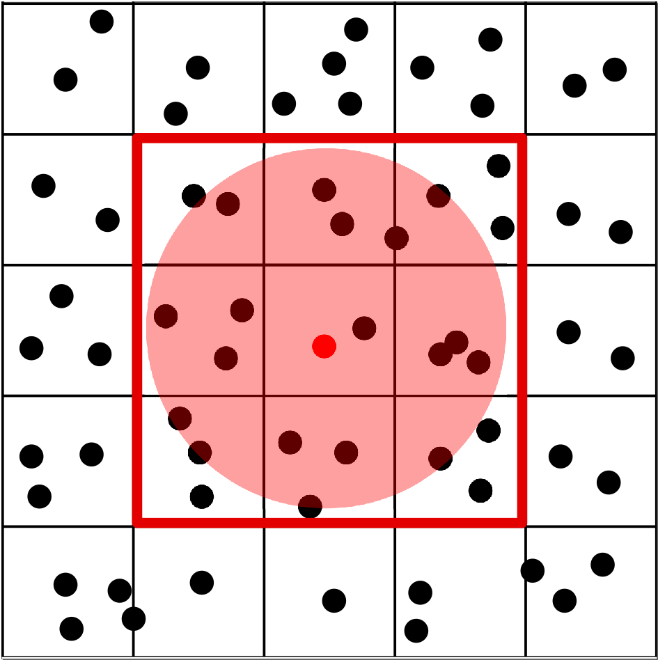

## Environment

The local environment is an important notion in agent-based modeling. The neighboring
agents of a certain agent can often influence its behavior. In BioDynaMo one can
request neighborhood information through the `Environment` class.

`Environment` is an abstract class in BioDynaMo with several available implementations,
such as `UniformGridEnvironment`, `KDTreeEnvironment`, and `OctreeEnvironment`.
You can switch between the different default environment by setting the [`Param::environment`](https://biodynamo.org/api/structbdm_1_1Param.html#a14d79b60569e6ba86588ef286e72a0db) value.

## Uniform Grid

The uniform grid method [1] imposes a regularly-spaced 3D
grid within the simulation space. Each box of the grid
contains only the agents that are confined within its subspace.
Finding the neighboring agents of a particular agent can be
done by only taking into account the boxes surrounding that
particular agent, as illustrated in 2D in the figure below.



The agent that we want to find the neighborhood for is colored red, and its
interaction radius is highlighted in red. We only consider the
agents in the 9 surrounding boxes (27 in 3D) around which
a red line is drawn in the figure. By default the box length is set to the size
of the largest agent in the simulation.

[1] Hesam, Ahmad, et al. "GPU Acceleration of 3D Agent-Based Biological Simulations." arXiv preprint arXiv:2105.00039 (2021).

### Setting a custom box length

In some cases you might want to set the box length to a non-default value. The
code snippet below shows how this can be achieved

```c++
Simulation sim("my-sim");
auto* env = dynamic_cast<UniformGridEnvironment*>(sim.GetEnvironment());
env->SetBoxLength(15);
```

Since the mechanical interactions of agents relies on size of the agents, the mimimum
box length size must be greater than the largest object in your simulation. If this is not the case, an error will occur to point this out.

## Create a custom Environment

You can create a custom environment by inheriting from the `Environment` class and
implementing the required functions. You can then set it as follows:

```c++
Simulation sim("my-sim");
MyEnvironment environment;
sim->SetEnvironment(&environment);
```