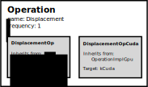

Operations are functions that are executed at a given frequency throughout
the simulation.
To execute a function for *specific* simulation objects have a look at
biology modules.
An operation can have multiple implementations. Each implementation can target a different type of hardware (e.g. CPU or GPU) as shown in the following image:



This example shows an overview of the displacement operation; one of the default operations in BioDynaMo.
This operation is implemented for different computing targets, of which two are shown in the image above.
The `DisplacementOp` implementation targets execution on CPUs, whereas `DisplacementOpCuda` targets execution on GPUs using the CUDA framework.

An operation operates at a certain frequency, which can be set after *registering* the operation.

## Registering an operation

Operations are stored in the `OperationRegistry` in BioDynaMo.
Any new operation that you wish to add to BioDynaMo needs to be registered before it can be used.
Let's use the displacement operation as an example to see how this works.

First, create two files: a header file (.h) and an implementation file (.cc).
The header file contains the logic of your operation, whereas the implementation file registers the operation.

```cpp
// File: displacement_op.h (minimal version)

struct DisplacementOp : public OperationImpl {
  // This macro will generate the boilerplate code. It must be included.
  BDM_OP_HEADER(DisplacementOp);

  // Here you define you operation's logic. The `sim_object` pointer is a handle
  // to each simulation object in your simulation
  void operator()(SimObject* sim_object) override {
    // In the displacement operation we check the environment of `sim_object`,
    // and apply a displacement force if there is a collision
  }
}
```

```cpp
// File: displacement_op.cc (minimal version)

#include "core/operation/operation.h"
#include "core/operation/displacement_op.h"

// This registers our DisplacementOp in the OperationRegistry under 
// the name "displacement". Since this operation is targeted to run 
// on a CPU, we specify "kCpu"
BDM_REGISTER_OP(DisplacementOp, "displacement", kCpu);
```

Here the link for the complete API documentation for [Operation](/bioapi/structbdm_1_1Operation.html)

## Usage example

Once an operation is registered, using it for a simulation is done as follows.

```cpp
Simulation simulation("my-sim");
auto* scheduler = simulation.GetScheduler();

// Get the operation by its registered name
auto* displacement_op = NewOperation("displacement");

// Change the frequency to the desired number
// 1 is the default, so we could have skipped this step
displacement_op->frequency_ = 1;

// Schedule the operation for execution
scheduler->ScheduleOp(displacement_op);

// Simulate for 10 timesteps. The displacement operation will be 
// executed every timestep, because the frequency is 1
simulation.Simulate(10);
```

Once you schedule your operation with `Scheduler::ScheduleOp` you are not longer responsible for the memory management; the scheduler will take care of that.
If you do not schedule your operation, you should free the created operation to avoid memory leaks. In the above example it would be `delete displacement_op`.

## Schedule multiple operations with the same name

There are cases in which you might want to schedule multiple instances of a single operation, each with a slightly different logic.
An example could be to query how many simulation objects there are with a certain diameter. For example: how many simulation objects are there with a diameter greater than 10, and the same question for a diameter greater than 20.
You could approach this the following way.

```cpp
// File: check_diameter.h

// Create an operation implementation with a state
struct CheckDiameter : public OperationImpl {
  BDM_OP_HEADER(CheckDiameter);
  
  void operator()(SimObject* sim_object) override {
    if (sim_object->GetDiameter() > threshold_) {
      counter_++;
    }
  }

  // The state consists of these two data members
  double threshold_ = 0;
  // Data members that can be changed in `operator()(SimObject* 
  // sim_object)` need to be of atomic type to avoid race conditions
  std::atomic<uint32_t> counter_ = 0;
}

```

```cpp
// File: check_diameter.cc

#include "core/operation/operation.h"
#include "check_diameter.h"

BDM_REGISTER_OP(CheckDiameter, "check_diameter", kCpu);

```

```cpp
Simulation simulation("test_sim");
auto* scheduler = simulation.GetScheduler();

// We instantiate two "check_diameter" operations
auto* check_diameter10 = NewOperation("check_diameter");
auto* check_diameter20 = NewOperation("check_diameter");

// Change the threshold values of each instantiation
check_diameter10->GetImplementation<CheckDiameter>()->threshold_ = 10;
check_diameter20->GetImplementation<CheckDiameter>()->threshold_ = 20;

// Schedule both of them
scheduler->ScheduleOp(query_op10);
scheduler->ScheduleOp(query_op20);

// Now your simulation will run both operations at each timestep
simulation.Simulate(1);
```

Since an `Operation` can have multiple implementations (`OperationImpl`), we need to specify which of the implementations we are targeting with `GetImplementation<T>()`, where `T` is the type of your operation implementation.
