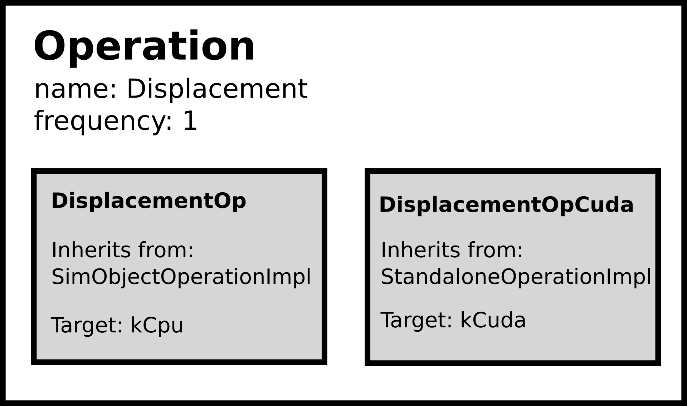

Operations are functions that are executed at a given frequency throughout the simulation.
To execute a function for *specific* agents have a look at behaviors.
**An operation can have multiple implementations.**
Each implementation can target a different type of hardware (e.g. CPU or GPU) as shown in the following image:



This example shows an overview of the displacement operation; one of the default operations in BioDynaMo.
This operation is implemented for different computing targets, of which two are shown in the image above.
The `MechanicalForcesOp` implementation targets execution on CPUs, whereas `MechanicalForcesOpCuda` targets execution on GPUs using the CUDA framework.
As a user, you can develop new *operation implementations* and append them to an *operation* with a specific name.
The BioDynaMo core will be able to select the right implementation based on your system (i.e. having a GPU or not).

An operation operates at a certain frequency, which can be set after *registering* the operation.

## Operation implementation types
There are two types of operation implementations:

1. `AgentOperationImpl`: executed for each agent at the given frequency
2. `StandaloneOperationImpl`: executed once at the given frequency

`AgentOperationImpl` is used for operation implementations that will be executed for all agents. The displacement operation in BioDynaMo is such a type of operation: for every agent we calculate the displacement force if there is a collision with other agents.
`StandaloneOperationImpl` is used for operations that will be executed once at the operation's given frequency. The diffusion operation is such a type of operation: it is independent of how many agents there are.
The displacement operation implementation for GPUs is also a `StandaloneOperationImpl` type, because the GPU implementation will not need to be executed for each agent.

Both implementation types have a `SetUp()` and `TearDown()` method. These methods are, respectively, executed before and after the operation is executed.
For GPU operations these can be used to copy data between the GPU and CPU.

## Registering an operation

Operations are stored in the `OperationRegistry` in BioDynaMo.
Any new operation implementation that you wish to add to BioDynaMo needs to be registered before it can be used.
Let's use the displacement operation as an example to see how this works.

First, create two files: a header file (.h) and an implementation file (.cc).
The header file contains the logic of your operation, whereas the implementation file registers the operation.

```cpp
// File: mechanical_forces_op.h (minimal version)

struct MechanicalForcesOp : public AgentOperationImpl {
  // This macro will generate the boilerplate code. It must be included.
  BDM_OP_HEADER(MechanicalForcesOp);

  // Here you define you operation's logic. The `agent` pointer is a handle
  // to each agent in your simulation
  void operator()(Agent* agent) override {
    // In the displacement operation we check the environment of `agent`,
    // and apply a displacement force if there is a collision
  }
}
```

```cpp
// File: mechanical_forces_op.cc (minimal version)

#include "core/operation/operation.h"
#include "core/operation/mechanical_forces_op.h"

// This registers our MechanicalForcesOp in the OperationRegistry under 
// the name "mechanical forces". Since this operation is targeted to run 
// on a CPU, we specify "kCpu"
BDM_REGISTER_OP(MechanicalForcesOp, "mechanical forces", kCpu);
```

With the above two files you will be able to successfully add the operation implementation
`MechanicalForcesOp` to the operation named "mechanical forces".
This operation is now accessible in your simulation code as we will see below.
By default, any operation is executed once every timestep (i.e. the frequency is 1).

Here the link for the complete API documentation for [Operation](/bioapi/structbdm_1_1Operation.html)

## Usage example

Once an operation operation is registered, using it for a simulation is done as follows.

```cpp
Simulation simulation("my-sim");
auto* scheduler = simulation.GetScheduler();

// Get the operation by its registered name
auto* mechanical_forces_op = NewOperation("mechanical forces");

// Change the frequency to the desired number
// 1 is the default, so we could have skipped this step
mechanical_forces_op->frequency_ = 1;

// Schedule the operation for execution
scheduler->ScheduleOp(mechanical_forces_op);

// Simulate for 10 timesteps. The displacement operation will be 
// executed every timestep, because the frequency is 1
simulation.Simulate(10);
```

Once you schedule your operation with `Scheduler::ScheduleOp` you are not longer responsible for the memory management; the `Scheduler` will take care of that.
If you do not schedule your operation, you should free the created operation to avoid memory leaks. In the above example it would be `delete mechanical_forces_op`.

## Schedule multiple operations with the same name

There are cases in which you might want to schedule multiple instances of a single operation, each with a slightly different logic.
An example could be to query how many agents there are with a certain diameter. For example: how many agents are there with a diameter greater than 10, and how many agents are there with a diameter greater than 20.
You could approach this the following way.

```cpp
// File: check_diameter.h

// Create an operation implementation with a state
struct CheckDiameter : public AgentOperationImpl {
  BDM_OP_HEADER(CheckDiameter);

  CheckDiameter() {}

  // Since atomic members don't have a deleted copy constructor, we have to
  // define how to copy its value in this operation's copy constructor
  explicit CheckDiameter(const CheckDiameter& other) {
    this->counter_ = other.counter_.load();
  }

  void operator()(Agent* agent) override {
    if (agent->GetDiameter() > max_diameter_) {
      counter_++;
    }
  }

  // The state consists of these two data members
  double max_diameter_ = 1;
  // Data members that can be changed in `operator()(Agent*
  // agent)` need to be of atomic type to avoid race conditions
  std::atomic<uint32_t> counter_;
};

```

```cpp
// File: check_diameter.cc

#include "core/operation/operation.h"
#include "check_diameter.h"

BDM_REGISTER_OP(CheckDiameter, "check_diameter", kCpu);

```

```cpp
Simulation simulation("test_sim");
auto* scheduler = simulation.GetScheduler();

// We instantiate two "check_diameter" operations
auto* check_diameter10 = NewOperation("check_diameter");
auto* check_diameter20 = NewOperation("check_diameter");

// Change the threshold values of each instantiation
// We have to specify the type of the operation implementation `CheckDiameter`
check_diameter10->GetImplementation<CheckDiameter>()->max_diameter_ = 10;
check_diameter20->GetImplementation<CheckDiameter>()->max_diameter_ = 20;

// Schedule both of them
scheduler->ScheduleOp(check_diameter10);
scheduler->ScheduleOp(check_diameter20);

// Now your simulation will run both operations at each timestep
simulation.Simulate(10);
```

Since an `Operation` can have multiple implementations (`OperationImpl`), we need to specify which of the implementations we are targeting with `GetImplementation<T>()`, where `T` is the type of your operation implementation.

## Unschedule an operation

If you wish to unschedule an operation from a simulation, you can do that in the
following way (we reuse the `CheckDiameter` operation from before):

```cpp
Simulation simulation("test_sim");
auto* scheduler = simulation.GetScheduler();

auto* check_diameter = NewOperation("check_diameter");
scheduler->ScheduleOp(check_diameter);

// Your simulation will run CheckDiameter at each timestep
simulation.Simulate(10);

// Unschedule the CheckDiameter operation
scheduler->UnscheduleOp(check_diameter);

// Your simulation will not run CheckDiameter anymore
simulation.Simulate(10);
```

## Get operations

The scheduler of BioDynaMo runs a list of all operations that have
been added either by default or by calling `Scheduler::ScheduleOp(op)`.
A pointer to these operations can be retrieved by calling: `Scheduler::GetOps(name)`. 
This function returns a vector of operation pointers with operations that match 
the given name.
If the given operation name is a protected operation the returned vector will be empty.
A default (non protected) operation can be unscheduled in the following way:

```cpp
Simulation simulation("test_sim");
auto* scheduler = simulation.GetScheduler();

auto ops = scheduler->GetOps("mechanical forces");
scheduler->UnscheduleOp(ops[0]);

// Your simulation will not run the displacement operation
simulation.Simulate(10);
```
