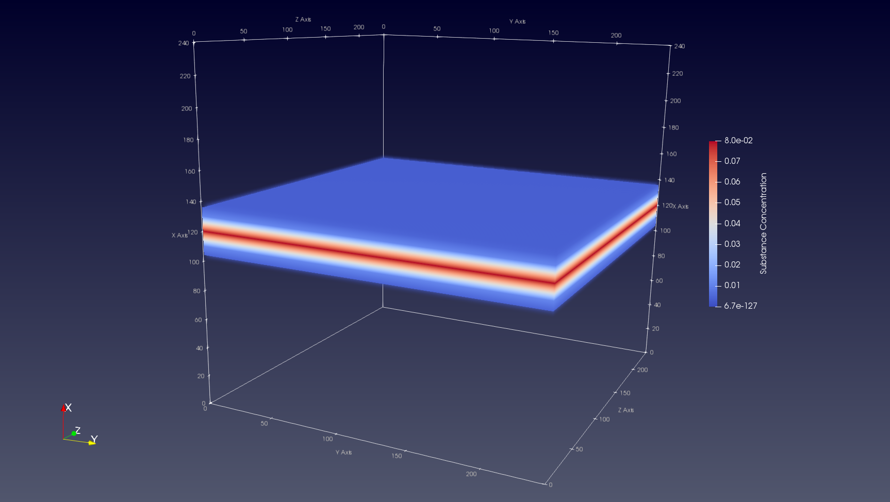

You might want to initialize the concentration of one or more of the substances
in your simulation. In this tutorial we shal take a look on how to do so.

## Tutorial by example

Go into the `test/system/substance_initialization/src` directory and open the source file
`substance_initialization.h` in your favorite editor.

### 1. List the substance(s)

We start the code off by listing the substances we will use in our simulation in an enum
data structure. In this example we just create one substance.

```cpp
enum Substances { kSubstance };
```

### 2. Specify the space dimensions
We bound our space to keep things simple.

```cpp
param->bound_space = kClosed;
param->min_bound = -100;
param->max_bound = 100;
```

### 3. Create a cell

We create one cell with diameter 10, at a random location

```cpp
auto construct = [](const Real3& position) {
  Cell* cell = new Cell(position);
  cell->SetDiameter(10);
  return cell;
};
ModelInitializer::CreateAgentsRandom(param->min_bound, param->max_bound, 1,
                                    construct);
```

### 4. Define the substance(s)
We define the diffusion parameters of the substance(s) in our simulation. We
choose a diffusion coefficient of 0.5, a decay constant 0f 0 and a resolution
of 20.

```cpp
ModelInitializer::DefineSubstance(kSubstance, "Substance", 0.5, 0, 20);
```

### 5. Initialize the substance(s)
Now comes the most important part of the tutorial: initializing our substance(s)
concentration values throught the space. We will use the function
`ModelInitializer::InitializeSubstance` for this purpose.
In this example we initialize our substance according to a Gaussian distribution.

```cpp
ModelInitializer::InitializeSubstance(kSubstance, "Substance",
                                      GaussianBand(0, 5, Axis::kXAxis));
```

Let's break this down. We first pass the substance enum id and name in the
function in order to specify which substance we want to initialize. Then we
simply pass the model we want to initialize the substance with (we call these "initializers").
In this case we choose for a GaussianBand with a mean value of 0 along the
x-axis, and a variance of 5.

The result (visualized with ParaView) is the following:

[](/docs/userguide/substance_initializers/#5-initialize-the-substances)

## Creating a custom substance initializer
In this tutorial you have seen how to initialize a substance's concentration
values with the `GaussianBand` initializer. Of course this is not the only
model to initialize a substance with. We have several predefined initializers
available in BioDynaMo, and you can create your own.

Let's take a look at an existing substance initializer.

### Option 1: Functors
```cpp
struct GaussianBand {
  real_t mean_;
  real_t sigma_;
  uint8_t axis_;

  GaussianBand(real_t mean, real_t sigma, uint8_t axis) {
    mean_ = mean;
    sigma_ = sigma;
    axis_ = axis;
  }

  real_t operator()(real_t x, real_t y, real_t z) {
    switch(axis_) {
      case Axis::kXAxis: return ROOT::Math::normal_pdf(x, sigma_, mean_);
      case Axis::kYAxis: return ROOT::Math::normal_pdf(y, sigma_, mean_);
      case Axis::kZAxis: return ROOT::Math::normal_pdf(z, sigma_, mean_);
      default: throw std::logic_error("You have chosen an non-existing axis!");
    }
  }
};
```

The above code is what is called a 'functor' in C++. Here it basically describes
the model or operation that you want to perform on the entire diffusion space.
In the constructor we save the mean, variance and orientation axis, so that this
initializer can be used generically. The operator tells BioDynaMo what the concentration
value should be for x, y, and z. BioDynaMo will make sure that your operator is
executed over the whole simulation space. In this example we make use of a function
that models the normal (i.e. Gaussian) probability density function.

### Option 2: Lambdas
Functors are nice if you want to create a generic model that you can apply for
several input variables (e.g. different means, sigmas in the above example).
But you might want to just keep it short and simple; in which case lambdas are
nice to use. We can accomplish exactly the same result as the above example with
the following lambda:

```cpp
auto gaussian_band = [](real_t x, real_t y, real_t z) {
  return ROOT::Math::normal_pdf(x, 5, 0);
};
```

Much simpler right? As you can see we have hard-coded some of the variables that
we had generalized in our functor. So depending on your use case or preference,
lambdas might be the way to go.
