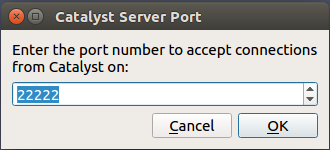
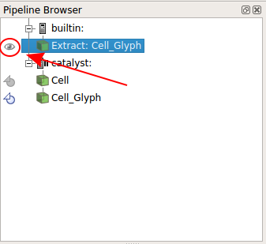
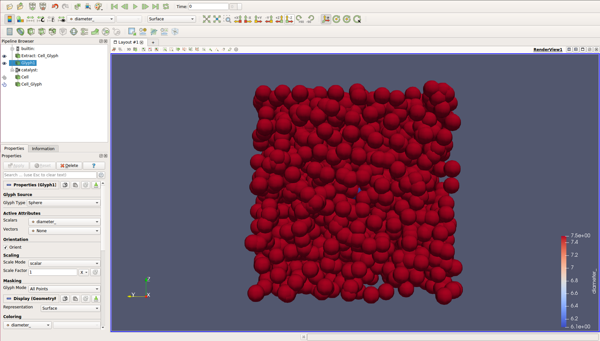
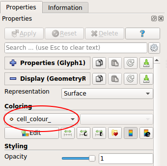
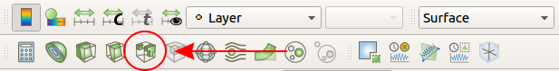

Written by Jean de Montigny

## Introduction

BioDynaMo is platform for computer simulations of biological dynamics. You can learn more about BioDynaMo by accessing its official website.

This Tutorial in designed for user with limited knowledge of C++ language and will teach you the basics of BioDynaMo:

* Create, build and run a new project
* Create cells with a specific behaviour
* Extend an existing structure
* Visualize a simulation

### Installation

You can access the installation page by clicking [here](/docs/userguide/installation/).

### Structure creation

As BioDynaMo is written is C++, it needs a particular structure. Fortunately, this procedure is really easy with BioDynaMo. To create a new project, you just need to run the command `biodynamo new <project>`. If you wish to have your Github account linked to your project you can append the `--github` option to the command. Try opening a terminal and running the command `biodynamo new tutorial`. This will create a folder named tutorial in your current directory, containing everything that BioDynaMo needs. Inside `tutorial/src`, two files with the basic structure already written have been created: `tutorial.cc` and `tutorial.h`. `tutorial.cc` will only contain the call to function `Simulate` which is defined in  `tutorial.h`. This is were the core of our work will be added. You can easily compile your code using the command `biodynamo build` and run your simulation by typing the command `biodynamo run`.
You can also directly use `biodynamo demo tumor_concept` to try this demo.

## Cells and behaviors

The structure built in the previous chapter only creates a single cell. In this chapter we will create more cells in order to build a square of 2 400 randomly distributed cells. Afterwards, we will create a number of cancerous cells, that will grow and divide.

### Creating cells

To do so, we will work only on the `Simulate` function of the `tutorial.h` file.
First, we create a lambda function to set the simulation [parameters](/docs/userguide/parameter/) programmatically.
Second, we create a BioDynaMo simulation.

```cpp
auto set_param = [](Param* param) {
  param->bound_space = true;
  param->min_bound = 0;
  param->max_bound = 100;  // cube of 100*100*100
};
Simulation simulation(argc, argv, set_param);
```

Afterwards, we obtain a reference to a few important objects.

  * `ResourceManager` will store our agents.
  * `Random` is a random number generator.
  * `Param` holds our simulation parameters.

```cpp
auto* rm = simulation.GetResourceManager();
auto* random = simulation.GetRandom();
auto* param = simulation.GetParam();
```

Let's define the number of cells we want to create and allocate three variables to hold the position (x_coord, y_coord and z_coord).
```cpp
size_t nb_of_cells=2400; // number of cells in the simulation
double x_coord, y_coord, z_coord;
```

Then, with a simple loop from 0 to the number of cells, generate uniform distributed values for x, y and z and create a new cell object.
```cpp
for (size_t i = 0; i < nb_of_cells; ++i) {
  // our modelling will be a cell cube of 100*100*100
  // random double between 0 and 100
  x_coord = random->Uniform(param->min_bound, param->max_bound);
  y_coord = random->Uniform(param->min_bound, param->max_bound);
  z_coord = random->Uniform(param->min_bound, param->max_bound);

  // creating the cell at position x, y, z
  Cell* cell = new Cell({x_coord, y_coord, z_coord});
  // set cell parameters
  cell->SetDiameter(7.5);

  rm->AddAgent(cell);  // put the created cell in our cells structure
}
```

We now have our structure containing all the 2400 cells! The code in charge of running our modelling is already written and will simulate it for only one step. Lets change this to simulate for 200 steps.
```cpp
simulation.GetScheduler()->Simulate(200);
```

### Behavior

In the previous chapter, we created a great number of cells. However, those cells don’t do anything! We will here create a cancerous cell that will grow and divide when it reaches a certain diameter. For this, we will define a new behavior structure Growth that will be applied to cell elements, and we will make this Growth copied into the cell daughter (so the daughter will also contain an instance of the behavior Growth)
```cpp
struct Growth : public Behavior {
  BDM_STATELESS_BEHAVIOR_HEADER(Growth, Behavior, 1);

  Growth() { CopyToNewAlways(); }
  virtual ~Growth() {}

  void Run(Agent* so) override {
    // code to be executed at each simulation step
  }
};
```

We are now able to add any code in the Run() method, that will be executed at each simulation step for each cell containing this Growth. In our case, it will be a cellular growth, until a certain diameter is reached and then a cell division:
```cpp
if (auto* cell = dynamic_cast<Cell*>(so)) {
  if (cell->GetDiameter() < 8) {
    cell->ChangeVolume(400);
  }
  else {
    cell->Divide();
  }
}
```

Of course, we need to create at least one new cell that contains our `Growth` in our `Simulate` method
```cpp
Cell* cell = new Cell({20, 50, 50});
cell->SetDiameter(6);
cell->AddBehavior(new Growth());
rm->AddAgent(cell);  // put the created cell in our cells structure
```

Run running it using `biodynamo run`. This code is now able to create and simulate 2 400 normal cells and 1 cancerous cell that will grow and divide! Complete code can be found in `demo/tumor_concept`.

## Visualisation using Paraview

In the previous chapter we created a simulation of a great number of cell, also containing dividing cancerous cells, but we were not able to visualize anything, yet! In this chapter, we will set up visualization using Paraview (included in the BioDynaMo package). Dedicated page about visualization can be accessed [here](/docs/userguide/visualization/)

### Paraview

[Paraview](https://www.paraview.org/) is an open source application for interactive and scientific visualisation. First of all, we need to tell BioDynaMo that we will use Paraview and so that we want the visualisation to be enable. To do that, we need to create a configuration file `bdm.toml` in the tutorial folder. Visualisation is of course not the only configuration we can do using this file. You can allow live visualisation (`insitu=true`) and/or export visualisation (here every 2 simulation step) by adding in `bdm.toml`
```cpp
[visualization]
insitu = false
export = false
interval = 2
```

Afterwards, we have to define which agents will be considered for visualization:
```cpp
[[visualize_agent]]
name = "Cell"
```

Because those visualization parameters are not in the source code, you don’t need to compile your code again.
We can note that instead of creating a configuration file, you can do the same by creating this lambda function and passing it to the constructor of `Simulation`
```cpp
auto set_param = [](auto* param) {
  param->insitu_visualization = true; // allows live visualisation
  param->export_visualization = true; // allows export of visualisation files
  param->visualization_interval = 2; // export visualisation files every 2 steps
  param->visualize_agents["Cell"] = std::set<std::string>{ "" };
}
Simulation simulation(argc, argv, set_param);
```

Once again, it is important to note that if you want to change any visualization parameter using this second method, you will have to compile your code again. That is not the case using a configuration file. Hence, using the toml file is highly recommended.

We will first have a look at export visualization then the live visualization. In both cases, simply run Paraview using the console line command `paraview &`. This window should appears

[](/docs/userguide/tumor_concept/#paraview)

#### Export Visualisation (recommended)

In the configuration file (bdm.toml), turn the export parameter to true then run your modelling. You’ll notice the creation of several new files with the following file extensions `*.pvsm, *.pvtu, *.vtu, *pvti, *.vti` in the folder output/tutorial. Open ParaView and load the generated state file as described in [Section Visualization](/docs/userguide/visualization/#export-visualization-files) (file -> load state)

A major advantage of export visualisation, in addition of not impacting the simulation time, is that you can visualise your modelling freely in time. using the arrows in the top menu, you can choose respectively to go back to the beginning of the simulation, go one step back, run normally, go one step further or go to the end of the simulation. You also can see witch step you are currently visualising (remember that this step number is the number of your modelling step divided by the export\_interval you choose in your configuration file).

[](/docs/userguide/tumor_concept/#paraview)

#### Live visualisation

To use live visualisation, turn the `insitu` option of your configuration file to true, then click on the _Catalyst_ top menu, and select _Connect_ . This windows should appears

[](/docs/userguide/tumor_concept/#paraview)

Click OK, then this windows should appears

[](/docs/userguide/tumor_concept/#paraview)

Your Paraview is now accepting connections! Click OK, go back to the _Catalyst_ menu, and select _Pause Simulation_. Using the same console, launch your tutorial simulation. You now notice that the programme stop right before running the simulation, because we used the Paraview _Pause Simulation_.

[](/docs/userguide/tumor_concept/#paraview)

Go back to Paraview. You notice that new objects have appeared in the _Pipeline Browser_ section. Click on the round shape in front of _Cells Glyph_.

[](/docs/userguide/tumor_concept/#paraview)

A new Builtin object have appeared: _Extract: Cells Glyph_. Click on the eye in front of it.

[](/docs/userguide/tumor_concept/#paraview)

All cells appear on the screen!
You can now go to the _Catalyst_ menu, and select _Continue_. The simulation will run the number of steps you specified in your code.

[](/docs/userguide/tumor_concept/#paraview)

Even if live visualization is particularly useful to set or tune a simulation, it is capital to note that it also drastically slows down the simulation! One way to avoid this major problem is to export visualization files and read then after the modeling is done.

In both cases, even if we can now visualize our cell, they have all the same color, which can be a bit confusing and doesn't allow us to visualize properly what is going on.

### Adding layers color

In this chapter, we will modify our code in order to create a better coloring for our simulation.
A good idea would be to create a coloring depending on the layer of the cell. By this way, we could display several layers of cell, and have an other color for our cancerous cells.
To do that, we can extend the existing `Cell` class in order to add a new data member `cell_color`.
We will do that directly in our `tutorial.h` file by writing:

```cpp
// 0. Define my custom cell MyCell, which extends Cell by adding extra data
// members: cell_color and can_divide
class MyCell : public Cell {  // our object extends the Cell object
                              // create the header with our new data member
  BDM_AGENT_HEADER(MyCell, Cell, 1);

 public:
  MyCell() {}
  explicit MyCell(const Double3& position) : Base(position) {}

  FIXME api

  void SetCellColor(int cell_color) { cell_color_ = cell_color; }
  int GetCellColor() const { return cell_color_; }

 private:
  // declare new data member and define their type
  // private data can only be accessed by public function and not directly
  int cell_color_;
};

```

Each cell (implementing our new object `MyCell`) of the modelling is now able to have a value `cell_color_` that we will choose and use to display different colors!
In order to create cells with this attribute, we need to replace all `Cell` object by `MyCell` during cells creation (inside the `Simulate()` method). For example
```cpp
// Cell* cell = new Cell({x_coord, y_coord, z_coord});
MyCell* cell = new MyCell({x_coord, y_coord, z_coord});
```

Now that we are creating cells of type `MyCell`, we can set the cancerous cell `cell_color_` value to 8 (so it will have a really distinct color from non cancerous cells). To do so, simply use the method SetCellColor() we created
```cpp
cell->SetCellColour(8);
```

Do the same for the regular cells, setting the value depending on the y axis value. One possibility is to write
```cpp
cell->SetCellColour((int)(y_coord / param->max_bound * 6)); // will vary from 0 to 5. so 6 different layers depending on y_coord
```

This new simulation is now functional, however before running it, we need to tell BioDynaMo to communicate all `cell_color_` values. Do do that, we will modify the configuration file `bdm.toml` by modifying the `visualize_agent`
```cpp
[[visualize_agent]]
name = "MyCell"
additional_data_members = [ "cell_color_" ]
```

With those changes, we are now able to colorize our different layers. All you have to do, after displaying cells and creating the _Glyph_ filter (chapter 3.1) is to select your _Glyph_ filter and to select `cell_color_` in the _Coloring_ section.

[](/docs/userguide/tumor_concept/#adding-layers-color)

Well done, we can now visualize the different layers and the cancerous cell in red!

[](/docs/userguide/tumor_concept/#adding-layers-color)

However, there is still a little problem. The attribute `cell_color_` is not transmitted to the daughter cell after a division. You can also notice that it is not really easy to see the cancerous cells. We will solve those issues in the next chapter.

### Playing with filters

Even if our cancerous cells transmit their color to their daughter, it still is not really easy to spot them in the middle of thousands of other cells. This problem can be solve using the threshold filter function of ParaView. To do that, after displaying cells color as at the end of 3.2, click on the threshold filter button. This filter will be applied to the currently selected _Pipeline Browser_, so pay attention to select the correct one (_Glyph1_) before creating the threshold filter.

[](/docs/userguide/tumor_concept/#playing-with-filters)

On the _Properties_ menu, select the _Scalar_ _cell\_colour\__, put the minimum value at 7 and the maximum at 8 (so only the value of cancerous cell is selected) then click _Apply_

[](/docs/userguide/tumor_concept/#playing-with-filters)

Finally, choose the _Coloring_ mode _cell\_colour\__.

[](/docs/userguide/tumor_concept/#playing-with-filters)

Great, we can now choose to display either all the cells, or just the cancerous cells by selecting either the _Glyph1_ or the _Threshold1_ in the _Pipeline Browser_!

[](/docs/userguide/tumor_concept/#playing-with-filters)

This is of course just an example of what you can do with the threshold filters.

### Adding some complexity

We now have all we want to visualize our modeling in the best conditions, but this modeling itself is a bit limited. We should add some movements to it as well as a new mechanism to complexity cell division.
To add cell movement, we will modify the `Run()` method of our behavior `Growth`, and use the function `UpdatePosition()`. To generate the direction we will again use a random a random number generator.
We choose here to give stochastic movement only to growing cells, so we will write the movement just after the volume change

```cpp
auto* random = Simulation::GetActive()->GetRandom();
// create an array of 3 random numbers between -2 and 2
Double3 cell_movements =
    random->template UniformArray<3>(-2, 2);
// update the cell mass location, ie move the cell
cell->UpdatePosition(cell_movements);
```

Using the previous chapters, you should now be able to visualize cell movement during their growth.
This is great, but every cancerous cell grows and divides indefinitely, and that is a bit too much.
We will now add a mechanism to reduce the probability to divide, and assuring that a cancerous cell that didn't divide, will never divide any more.
To add a 0.8 probability to divide, simply write
```cpp
if (random->Uniform(0, 1) < 0.8) {
  cell->Divide();
}
```

Cells will now have only 80% chance to divide. However, it will have 80% chance to divide at every simulation step! We want that if a cell doesn't divide, it will not be able to divide any more.
To do that, we will create a new `MyCell` boolean attribute called `can_divide_`, like we did for `cell_colour_` attribute (see chapter 3.2).
```cpp
BDM_AGENT_HEADER(MyCell, Cell, 1);
```

and create two methods, `SetCanDivide()` and `GetCanDivide()`.
```cpp
void SetCanDivide(bool d) { can_divide_ = d; }
bool GetCanDivide() { return can_divide_; }
```

Then, like we did for `cell_colour_`, declare this data member as private
```cpp
bool can_divide_;
```

In the event constructor add the following lines to set `can_divide_` to true
in case of a `CellDivisionEvent`
```cpp
if (event.GetUid() == CellDivisionEvent::kUid) {
  // the daughter will be able to divide
  can_divide_ = true;
} else {
  can_divide_ = mother->can_divide_;
}
```

Now that we got a new attribute `can_divide_`, we need to change the `Run()` method to prevent cells that failed the 80% test to divide again.
```cpp
if (cell->GetCanDivide() && random->Uniform(0, 1) < 0.8) {
  cell->Divide();
} else {
  cell->SetCanDivide(false);  // this cell won't divide anymore
}
```

Codes corresponding to this chapter is accessible [here](https://github.com/BioDynaMo/biodynamo/tree/master/demo/tumor_concept).

You now have all the BioDynaMo cell basic knowledge to construct your own modeling!

## Diffusion

Coming soon.
