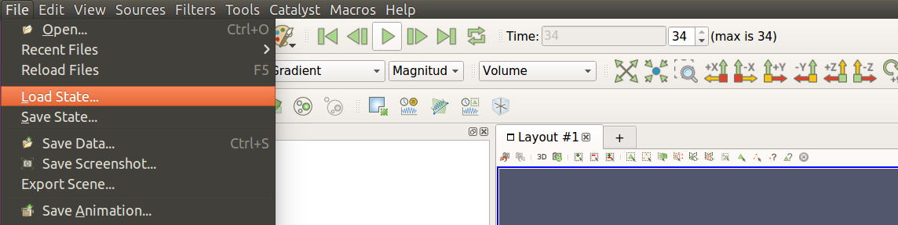
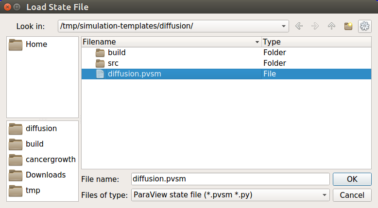
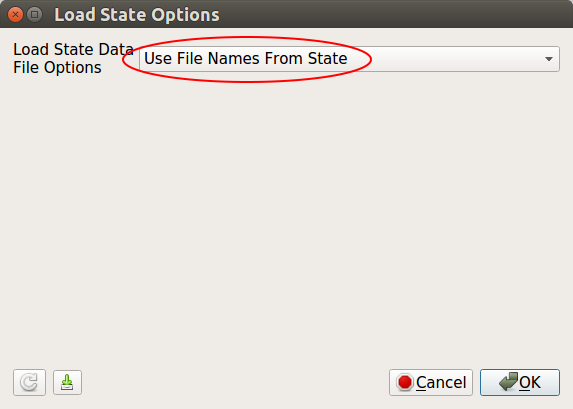

Visualization is disabled by default due to performance reasons, but enabling it is 
very easy. BioDynaMo can be configured through its own
configuration file: `bdm.toml`. Visualization is just one of the many configuration
options. Let's take a look at how to set it. We shall continue using the `hello_world`
example from the previous exercise.

## Create the configuration file

In your simulation directory `hello_world` create a new file called `bdm.toml`.
You can do this from the command line with the following command:

```bash
touch bdm.toml
```

## Export visualization files

One way to enable visualization is to export a visualization file every time step
(or every N time steps). In the `bdm.toml` file add the following lines:

```
[visualization]
export = true
interval = 1

	[[visualize_agent]]
	name = "Cell"

```

This will export a visualization file every time step. You can set the frequency
by setting the `interval`. Make sure that you run a good number of steps
so that the cells have time to divide. Set it to around 2000 for the `hello_world` example.
You can do this in `src/hello_world.h` in the `Simulate(time_steps)` function.
Run your simulation with `biodynamo run`.

Now we need to open ParaView:

<a class="sbox" target="_blank" rel="noopener">
    <div class="sbox-content">
    	<h4><b>Warning</b><h/4>
    	<p>Make sure you start ParaView from the project directory. Otherwise, ParaView might not find the exported files.
		</p>
    </div>
</a>
<br/>

```bash
paraview
```

Select "File->Load State" as shown below:



Navigate to your simulation output directory and select the `pvsm` file.



In the next window keep the default (_Use File Names From State_) and click OK.


<!-- ## Live visualization

Another way to enable visualization is through ParaView's live visualization.
This feature allows you to inspect your simulation while it is running. In your
`bdm.toml` file you add the following lines:

```
[visualization]
insitu = true
```
 -->
